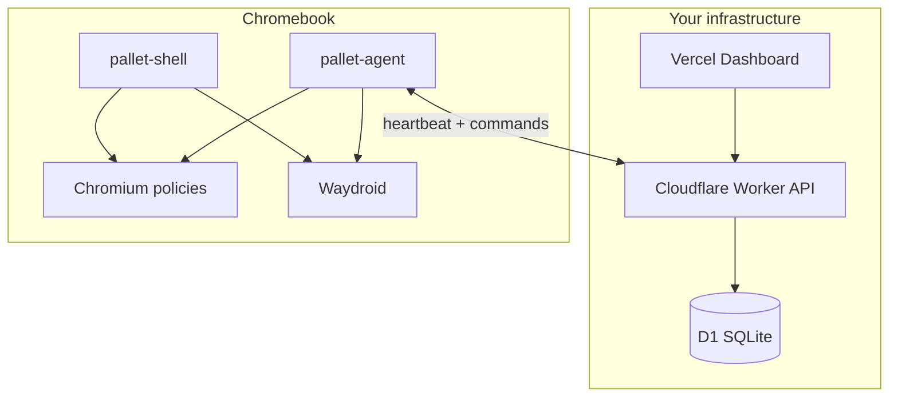

# Pallet OS

**Self-hosted, ChromeOS-style managed desktop for real Chromebooks** — no Google Admin console, no per-device licensing fees.

> ⚠️ **Legal gray area:** Optional Google Play via Waydroid GAPPS violates Google ToS for many use cases. See [docs/LEGAL.md](docs/LEGAL.md) before enabling Play Store in production.

## What you get

- **ChromeOS-like desktop** — bottom shelf, launcher grid + search, status tray, wallpaper, multiple resizable windows (labwc + custom shell)
- **Managed Chromium** — real enterprise `managed` policy JSON (homepage, URL blocklist, forced extensions, devtools disabled)
- **Android apps** — Waydroid with optional GAPPS; apps appear in launcher/shelf
- **Fleet management** — enrollment tokens, telemetry, policy push, lock/wipe/reboot from a web console
- **Runs on real Chromebooks** — Ubuntu 24.04 base + MrChromebox UEFI firmware + USB image (see [docs/CHROMEBOOK.md](docs/CHROMEBOOK.md))

## Architecture



Details: [docs/ARCHITECTURE.md](docs/ARCHITECTURE.md)

## Repo layout

```
server/      Cloudflare Worker API (+ Docker/local Node for dev)
dashboard/   Next.js admin UI (deploy to Vercel)
agent/       Go device agent
shell/       ChromeOS-style desktop shell (Go + React)
provision/   Chromebook install & image build scripts
docs/        Architecture, Chromebook install, legal notes
```

## 1. Stand up the control plane (one command)

### Production (recommended)

**API — Cloudflare Workers**

```bash
cd server
npm install
npx wrangler d1 create pallet-os          # note database_id
# Update wrangler.toml database_id
npx wrangler secret put ADMIN_PASSWORD
npx wrangler secret put JWT_SECRET
npm run db:migrate:remote
npm run deploy
```

**Dashboard — Vercel**

```bash
cd dashboard
# Set NEXT_PUBLIC_API_URL=https://your-worker.workers.dev
vercel deploy
```

Put the Worker behind Cloudflare Access or your tunnel — no raw origin ports required.

### Local dev (Docker)

```bash
chmod +x scripts/standup-control-plane.sh
./scripts/standup-control-plane.sh
# API: http://localhost:8787
# Dashboard: http://localhost:3000
# Login: admin / pallet-dev-secret
```

## 2. Enroll a Chromebook (one command)

Prerequisites: [docs/CHROMEBOOK.md](docs/CHROMEBOOK.md) (Developer Mode + MrChromebox UEFI).

```bash
# On the device (Ubuntu 24.04 or Pallet USB image first boot):
export PALLET_SERVER_URL="https://your-api.workers.dev"
export PALLET_ENROLLMENT_TOKEN="plt_..."   # from admin dashboard

curl -fsSL https://your-repo/provision/install-pallet-os.sh | sudo bash
# or if repo already on disk:
sudo PALLET_SERVER_URL=... PALLET_ENROLLMENT_TOKEN=... ./provision/install-pallet-os.sh
sudo reboot
```

Create enrollment tokens in the dashboard (**New enroll token**) or via API:

```bash
curl -X POST "$API/api/v1/admin/enrollment-tokens" \
  -H "Authorization: Bearer $ADMIN_TOKEN" \
  -H 'Content-Type: application/json' \
  -d '{"label":"lab-chromebook-1"}'
```

## 3. Build Chromebook USB image

```bash
sudo ./provision/build-chromebook-image.sh
sudo dd if=build/pallet-os-chromebook.img of=/dev/sdX bs=4M status=progress && sync
```

Boot the Chromebook from USB → first boot provisions Pallet OS → reboot into shelf desktop.

## Policy & commands

| Admin action | API | Agent behavior |
|--------------|-----|----------------|
| Edit global policy | `PUT /api/v1/admin/policy` | Writes Chromium JSON, shell config, Android reconcile |
| Per-device override | `PUT /api/v1/admin/devices/:id/policy` | Merged over global |
| Lock | `commands: lock` | `loginctl lock-sessions` |
| Wipe | `commands: wipe` | Clears `/home/pallet`, Waydroid data |
| Reboot | `commands: reboot` | `systemctl reboot` |

Example Chromium policy fragment in global policy:

```json
{
  "chromium": {
    "HomepageLocation": "https://intranet.example.com",
    "URLBlocklist": ["*.social.example"],
    "DeveloperToolsAvailability": 2,
    "ExtensionInstallForcelist": ["cjpalhdlnbpafiamejdnhcphjbkeiagm"]
  }
}
```

## OS updates

Unattended security upgrades via `unattended-upgrades` (provisioner enables). Agent and shell update via your own package pipeline or re-run provisioner with new binaries.

## Known limitations

- ARM Chromebooks not supported in v1
- Stock ChromeOS firmware cannot boot Pallet OS — MrChromebox required
- Waydroid performance varies by CPU; not identical to native ChromeOS ARC++
- Shell is ChromeOS-*like*, not a pixel-perfect clone
- Device command delivery is heartbeat-based (~30s latency)

## Security notes

| Area | Status |
|------|--------|
| Admin API auth | JWT after username/password — **change default password** |
| Device auth | JWT + device key hash on enroll |
| TLS | Required in production (Cloudflare/Vercel) |
| Agent binary trust | Install from your signed packages only |
| Chromium policy tamper | User cannot edit `/etc/chromium/policies/managed` without root |
| Root on device | `pallet` user is locked down; root still exists — consider full disk encryption |
| Play Store | Third-party GAPPS — compliance is your responsibility |

**Not yet hardened:** disk encryption by default, measured boot, agent binary signing, mTLS pinning, rate limiting on enroll endpoint.

## Development

```bash
make server    # typecheck + unit tests
make agent     # build Go agent
make shell     # build shell UI + binary
make test      # API smoke tests (requires running API)
```

See [TESTING.md](TESTING.md) for full validation without physical hardware.

## License

MIT — see individual components for bundled assets.
